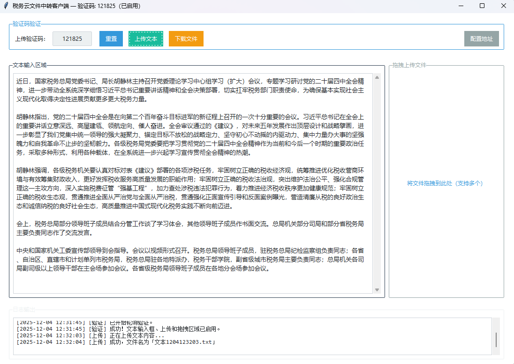

# 税务云文件中转客户端



------------------------------------------------------------------------

## 📌 项目简介

如果需要频繁将外网的文本导入内网，使用传统的网页端中转的话，只能先保存到txt文件中，再上传，很不方便，故开发本项目。

本项目是一个基于**ttkbootstrap**的图形界面桌面应用，结构清晰、界面现代，包含完整的日志系统、异常捕获、多线程上传/下载等企业级实践，源码可以作为学习python多线程、GUI开发的学习教材。

### 功能概述

-   支持文本内容一键上传

-   支持拖拽方式批量上传文件

-   自动轮询并校验验证码状态

-   查询并展示当前验证码对应的可下载文件列表

-   支持多选文件并进行批量下载

-   下载文件时可自由选择保存路径

-   界面实时输出操作日志及状态提示

### 配置与持久化相关

-   服务器地址可在 GUI 中配置并自动写入配置文件

-   程序启动时自动读取配置文件中的服务器地址（HOST）

-   自动保存用户输入的验证码并在下次启动时自动加载

-   在验证码有效期内自动复用已保存验证码，无需重复输入

-   配置文件不存在时自动生成默认配置

### 架构特性

-   UI 与网络通信完全解耦

-   所有网络操作采用异步线程，避免卡界面

-   请求层统一封装 Session、Cookie、Headers 与异常处理

------------------------------------------------------------------------

## 🚀 安装与运行

### 方式一：直接下载可执行文件
-   访问 Releases 页面
-   下载最新版本的 TaxCloudClient.exe
-   直接双击运行，无需安装依赖

### 方式二：从源码运行
#### 1. 克隆仓库

``` bash
git clone https://github.com/lwtw123456/TaxCloudExternalNetworkClient.git
cd TaxCloudExternalNetworkClient
```

#### 2. 安装依赖（Python 3.8+）

``` bash
pip install -r requirements.txt
```

#### 3. 运行程序

``` bash
python main.py
```

## 📖 使用指南
### 基本操作流程
#### 1.启动程序
-   双击运行 TaxCloudClient.exe
-   初次运行需要配置税务云地址
-   输入验证码
-   在顶部输入框输入6位数字验证码
-   点击"确定"按钮进行验证
#### 2.上传文件
-   文本上传: 在左侧文本区域输入内容，点击"文本上传"
-   文件上传: 直接将文件拖拽到右侧区域
#### 3.下载文件
-   点击"下载"按钮查看可下载文件列表
-   选择文件并保存到本地

### 界面说明
-   顶部控制区: 验证码输入和功能按钮
-   文本输入区: 编辑要上传的文本内容
-   文件拖拽区: 拖放文件到此区域上传
-   日志显示区: 实时显示操作状态和结果

------------------------------------------------------------------------
## 🔨 编译指南

如需自行编译，请使用以下命令：
``` bash
# 安装 Nuitka
pip install nuitka

# 编译为单文件可执行程序
nuitka --standalone --onefile --windows-console-mode=disable --enable-plugin=tk-inter --output-filename=TaxCloudClient.exe main.py
```
## 🧰 主要依赖

-   ttkbootstrap
-   tkinterdnd2
-   requests

------------------------------------------------------------------------

## 📁 项目结构

    ├── main.py                # 主程序
    ├── README.md              # 项目文档
    ├── requirements.txt       # 依赖列表
    ├── LICENSE                # 开源许可
    └── screenshots/           # 截图文件夹

------------------------------------------------------------------------

## 📄 开源协议

本项目基于 MIT License
开源，可自由用于个人或商业用途，但需保留版权声明。

------------------------------------------------------------------------

## 🤝 贡献

欢迎 PR、Issue 或建议改进！

------------------------------------------------------------------------

## ⭐ 支持本项目

如果你觉得这个项目对你有帮助，请给一个 Star ⭐！
